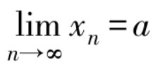

这一节介绍数列极限的定义，怎样用定义来证明极限，以及数列极限的计算方法．

> 数列的相关知识：

1. **数列{xn}：** 
    x1，x2，x3，…，xn，…，我们把这无穷多个数排成的序列称为数列，其中x1称为数列的首项，xn称为数列的第n项，或称为数列的一般项（通项）．

2. **等差数列{xn}：** 
    公差d=xn-xn-1∈R，通项公式为xn=xn+(n-1)d，前n项求和公式为sn = n(x1+x2)/2

3. **等比数列{xn}：** 
	公比q=xn/xn-1,通项公式为xn=x1·qn-1，前n项求和公式为sn=x1(1-qn)/(1-q)

> 一、数列极限的概念：

1. **数列极限的定义：** 
    设{xn}为一数列，如果存在一个常数a∈R，对于任意给定的正数ε，总存在一个正整数N，使得对于n>N时的一切n，不等式|xn-a|<ε均成立，则称常数a是数列{xn}的极限，或者称数列{xn}收敛于a，记作，或xn→a（n→∞）．

	
	

