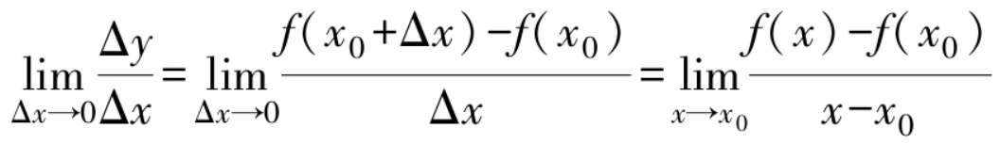
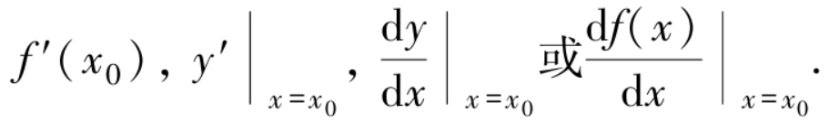
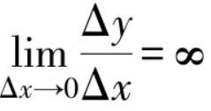

前面两个函数在x=x0处“导数”不存在，即不可导，而第三个函数在x=x0处是“可导”的．

> 一、割线与切线:

	在求切线斜率的过程中，需要用到极限。

> 二、导数的定义:

1. **导数的定义：** 
	设函数y=f（x）在x0的某个邻域内有定义，当x在x0处增量为Δx（x0+Δx在该邻域内）时，相应地，函数有增量Δy=f（x0+Δx）-f（x0）．如果 
	 
	存在，则称该极限为y=f（x）在点x0处的导数，记为 
	 
	这时也称函数y=f（x）在点x0处可导．如果该极限不存在，称函数y=f（x）在点x0处不可导． 
	特别地，如果时，也称函数y=f（x）在点x0处的导数为无穷大．

	

