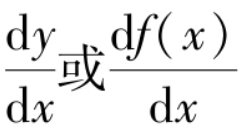
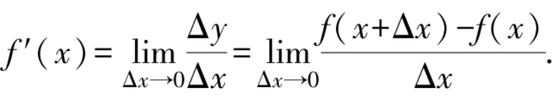

前面两个函数在x=x0处“导数”不存在，即不可导，而第三个函数在x=x0处是“可导”的．

> 一、割线与切线:

	在求切线斜率的过程中，需要用到极限。

> 二、导数的定义:

1. **导数的定义：** 
	设函数$y=f(x)$在x0的某个邻域内有定义，当x在x0处增量为Δx（x0+Δx在该邻域内）时，相应地，函数有增量$Δy=f(x_0+Δx)-f(x_0)$．如果 
	 
	存在，则称该极限为y=f（x）在点x0处的导数，记为 
	 
	这时也称函数y=f（x）在点x0处可导．如果该极限不存在，称函数y=f（x）在点x0处不可导． 
	特别地，如果时，也称函数y=f（x）在点x0处的导数为无穷大．

2. **导函数：** 
	如果y=f（x）在（a，b）内的每一点处均可导，则称y=f（x）在（a，b）内可导．这时（a，b）内的每一点都对应一个导数值，由函数的定义就可以得到一个新函数，则称这个函数为原来函数的导函数，简称为导数，记作f′（x），y′， 
	，即有 
	
	
> 三、简单函数的求导:

> 四、左右导数:

> 五、切线与法线方程:

> 六、函数的可导性与连续性的关系:

> 七、函数的和、差、积、商的求导法则:

> 八、反函数的求导法则:

> 九、求导公式与基本求导法则:

> 十、例题

https://www.mathdoubts.com/derivative-of-exponential-function/
